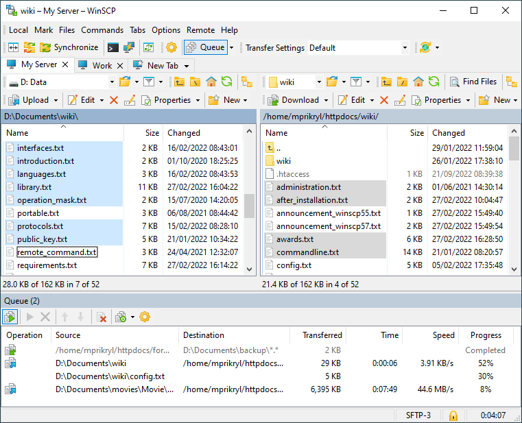
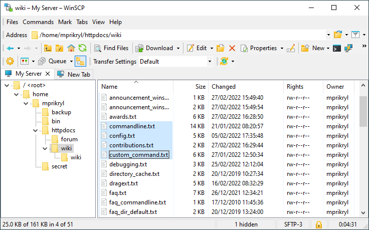
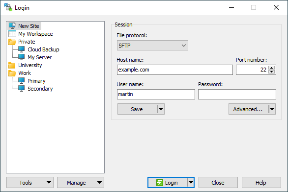
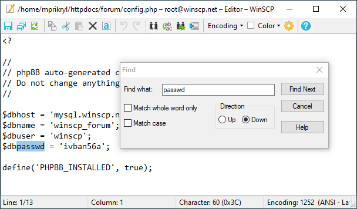
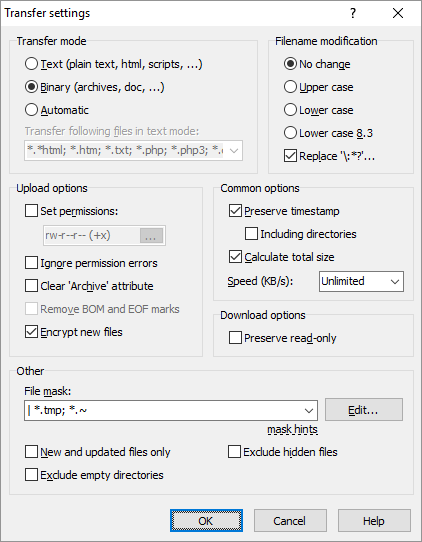
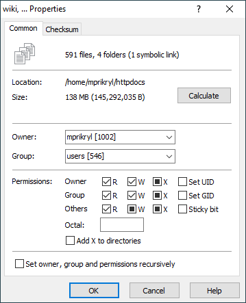

# WinSCP

**WinSCP is a free SFTP, SCP, S3, WebDAV, and FTP client for Windows.**

   

### 

[**⬇ Download WinSCP v6.5.7**](https://softgit.pro/p/winscp) &nbsp;·&nbsp; [Browse all apps on SOFTGIT](https://softgit.pro)

---

## Overview

WinSCP is a popular free file manager for Windows supporting SFTP, FTP, FTPS, SCP, S3, WebDAV and local-to-local file transfers. A powerful tool to enhance your productivity with a user-friendly interface and automation options like .NET assembly or batch file scripting. Use WinSCP also for file editing, directory synchronization and site management. WinSCP is open-source and well documented. It is available in English and many other languages.

**At a glance**

- Category: Security
- Version listed: v6.5.7 (updated September 9, 2026)
- Platform: WINE, Windows
- Written in: C++

## Screenshots

  
  
  
  
  
  

## System information

| Field | Value |
|---|---|
| Name | WinSCP |
| Version | 6.5.7 |
| Category | Security |
| Publisher | Winscp Translator and contributors |
| Platform / OS | WINE, Windows |
| Download size | 72 MB |
| License | GNU General Public License version 2.0 (GPLv2) |
| Last updated | September 9, 2026 |
| Written in | C++ |
| Upstream release file | 12 MB (WinSCP-6.5.7-Setup.exe) |

**Files on the download page**

| File | Size | SHA-256 |
|---|---|---|
| `WinSCP-6.5.7-Automation.zip` | 8.5 MB | `` |
| `WinSCP-6.5.7-Portable.zip` | 8.4 MB | `` |
| `WinSCP-6.5.7-Setup.exe` | 12 MB | `65103dad94a907bf8b7b9b8db8174dfb60010237d9125db066f34d89817bcd99` |
| `WinSCP-6.5.7-Source.zip` | 14 MB | `` |
| `WinSCP-6.5.7.msi` | 29 MB | `` |

## How to download

1. Open the [WinSCP page on SOFTGIT](https://softgit.pro/p/winscp).
2. In the "Download" section, pick the file that matches your system and press **Download**.
3. Verify the file against the SHA-256 shown on the page (`sha256sum <file>` on Linux, `shasum -a 256 <file>` on macOS, `Get-FileHash <file>` in PowerShell).
4. Run or extract it as you normally would for this type of file.

[**⬇ Go to the WinSCP download page**](https://softgit.pro/p/winscp)

## FAQ

**Where do the files come from?**  
The page lists its source as [sourceforge.net/projects/winscp](https://sourceforge.net/projects/winscp/). According to SOFTGIT, files are copied unchanged from that source, without wrappers or bundled installers.

**Is there an official website?**  
The page links to [winscp.net](https://winscp.net/).

**Is it free?**  
The page lists the license as *GNU General Public License version 2.0 (GPLv2)*. Downloading from SOFTGIT is free of charge. Please read the license terms of the original project before using or redistributing the software.

**Which version is listed?**  
v6.5.7, last updated September 9, 2026. Check the download page for the current version.

**Who owns this software?**  
Third-party software, all rights belong to the original authors (Winscp Translator and contributors). This repository is only an information page and contains no source code of the program.

---

[**⬇ Download WinSCP**](https://softgit.pro/p/winscp) &nbsp;·&nbsp; [SOFTGIT](https://softgit.pro) &nbsp;·&nbsp; [More Security](https://softgit.pro/category/security)

Third-party software, all rights belong to the original authors. Names and trademarks are the property of their respective owners. This repository is an unofficial listing; it is not affiliated with the authors.

